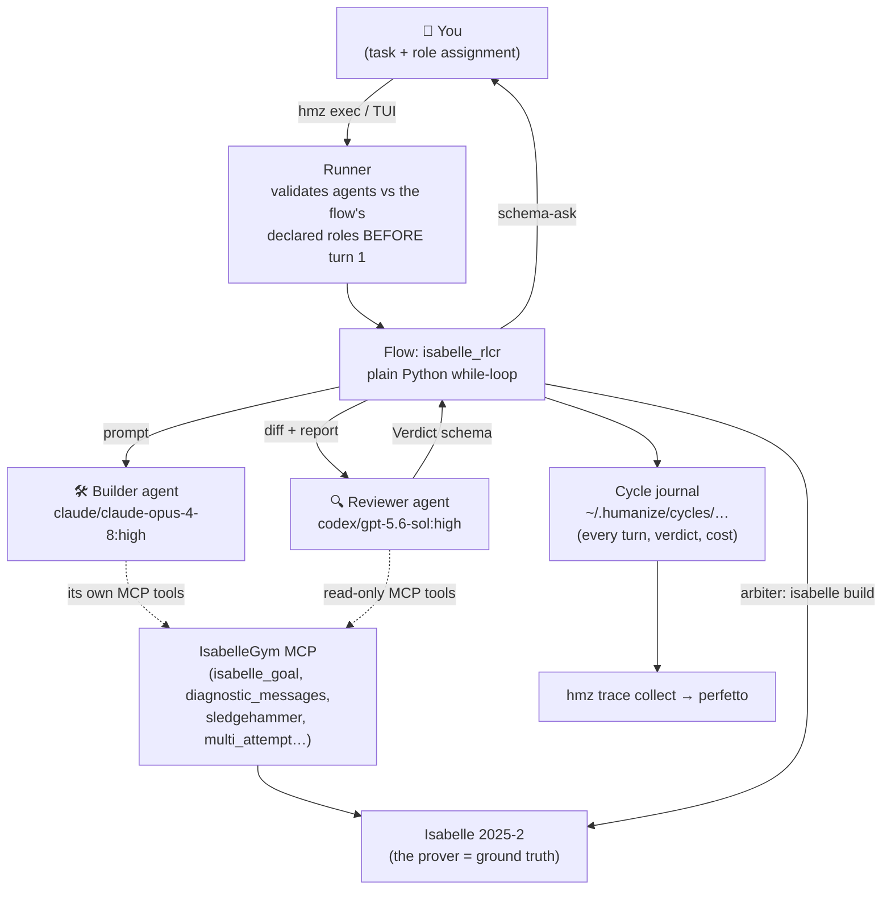

# Humanize2 Explained — What It Is, What It Isn't, and How the Loop Works

A plain-language companion to `humanize-analysis.md` (which is the deep technical
reference). Read this first if that document assumed too much.

---

## 1. What does humanize2 provide?

**One sentence: humanize2 (`hmz`) is a program that runs *other AI agents* for you —
several at once, in loops, with a written script (a "flow") deciding who does what —
and records everything that happens so you can replay it.**

The problem it solves: today's agent CLIs (Claude Code, Codex, Kimi, …) are each
single-agent tools. You open one, give it a task, watch it type. If you want the
workflow that humanize v1 pioneered — *one agent builds, a different agent reviews,
they iterate until done* — you would have to sit between two terminals copying output
back and forth, deciding when to stop, and keeping notes by hand.

humanize2 is the machine that sits between the terminals. Concretely it provides:

| Capability | What it means in practice |
|---|---|
| **Flow engine** | You write (or install) a small Python file — a *flow* — that says things like "give the task to the builder, then show the result to the reviewer, then feed the review back to the builder, repeat 42 times max." humanize2 executes it. |
| **Agent drivers** | It knows how to start, prompt, watch, steer, and stop 10+ different agent CLIs (claude, codex, kimi, grok, qwen, opencode, … plus a bundled DeepSeek one). Same flow, any mix of agents — you pick them on the command line. |
| **A TUI** (`hmz`) | A terminal app that looks like Claude Code but is actually a control room: pick a flow, assign agents to roles, watch them work, interrupt with two ctrl-Cs. |
| **Runs you can replay** | Every run gets a *cycle* journal: who said what, which model, which account, what it cost. `hmz trace collect` turns it into a timeline you can open in a browser (perfetto). |
| **Accounts & safety rails** | Named credential sets per CLI with automatic retry/fallback; opt-in scrubbed telemetry; explicit, blunt security documentation. |
| **Remote execution** | Optionally, agents run locally but their file edits and commands land on a remote machine (`hmz anchor`). |

The headline flows people actually run: `ralph_loop` (keep re-prompting one agent until
the task is done), `flame_chase` (two agents alternate on one task), `rlar` (one
builds, one reviews, the review becomes the builder's next prompt verbatim), and
`humanize1:rlcr` (the full v1 RLCR loop, ported).

---

## 2. What category of tool is it?

The landscape, and where hmz sits:

```
                        ┌─────────────────────────────────────┐
                        │  humanize2 = META-HARNESS           │
                        │  ("orchestrate agent CLIs")         │
                        └──────────────┬──────────────────────┘
                                       │ drives as OS processes
        ┌──────────────────────────────┼──────────────────────────┐
        ▼                              ▼                          ▼
┌───────────────┐            ┌───────────────┐            ┌───────────────┐
│  Claude Code  │            │     Codex     │            │     Kimi      │
│  (agent       │            │  (agent       │            │  (agent       │
│   harness)    │            │   harness)    │            │   harness)    │
└───────┬───────┘            └───────┬───────┘            └───────┬───────┘
        │ calls                      │ calls                      │ calls
        ▼                            ▼                            ▼
   tools: Bash, Edit,           tools: shell,                tools: …,
   Read, MCP servers…           MCP servers…                 MCP servers…
```

- **Not an agent framework** like LangGraph/CrewAI/AutoGen. Those are libraries where
  you build agents *inside* your Python process, calling model APIs directly. hmz does
  the opposite: it drives **unmodified, already-existing agent programs** as
  subprocesses. Your "agent" is the real Claude Code binary, with its real tools, real
  permissions model, real session logs — not a reimplementation.
- **Not an agent harness** like Claude Code itself. A harness wraps *one* model with
  tools and a UI. hmz wraps *harnesses*.
- **Closest category: multi-agent orchestrator / meta-harness.** Its honest one-liner
  from the README: *"Orchestrate, execute, and observe agent flows."* If Claude Code is
  an IDE for one agent, hmz is the CI/CD system for teams of agents: pipelines (flows),
  runners (drivers), artifacts (cycles), dashboards (TUI, traces).

A useful mental model: **humanize2 is to agent CLIs what a process supervisor + job
scheduler is to programs** — it doesn't do the work, it decides who works, in what
order, with what input, when to stop, and it keeps the logs.

---

## 3. What is humanize2 from an agent's point of view? Is it an MCP?

**No — emphatically not an MCP server. The relationship is the other way around.**

An MCP server is a *tool an agent calls*: the agent is the client, the MCP server
provides capabilities (like IsabelleGym's `isabelle_goal`). The agent decides when to
call it.

humanize2 is the agent's **operator**. The agent never sees it, never calls it, and
mostly doesn't know it exists. From the agent's point of view:

- It was started (as a subprocess) in some directory.
- Prompts arrive, exactly as if a user typed them.
- Its tools work exactly as configured in its own CLI config — including any MCP
  servers attached there.
- Sometimes a prompt it receives is actually a review written by *another* agent (it
  can't tell the difference).
- It may be interrupted, steered mid-turn, or killed.

```
   MCP relationship:          humanize2 relationship:

   ┌────────┐  calls tool    ┌────────────┐
   │  AGENT │ ─────────────► │ MCP server │        (agent is the client)
   └────────┘                └────────────┘

   ┌────────────┐  spawns + prompts    ┌────────┐
   │ humanize2  │ ───────────────────► │ AGENT  │  (humanize2 is the client)
   └────────────┘ ◄─────────────────── └────────┘
                      streams events/results
```

The two compose cleanly — and this is exactly the isabelle-humanize design: **hmz
drives the agents; IsabelleGym's MCP server gives those agents prover tools.** The two
systems never touch each other; they meet inside the agent, which is simultaneously an
hmz *subject* (receiving prompts) and an IsabelleGym MCP *client* (calling prover
tools).

---

## 4. What "tools" does humanize2 expose?

Since hmz is not an MCP server, it exposes no MCP tools. Its surfaces are for three
different audiences:

### 4.1 For the user: the CLI and TUI

| Command | What it does |
|---|---|
| `hmz` | Opens the TUI control room. |
| `hmz exec -f <flow> -a <agent> … "task"` | Runs a flow headlessly with named agents, e.g. `hmz exec -f ralph_loop -a dsh/deepseek-v4-flash:high "fix the build"`. |
| `hmz trace collect` | Assembles the last run's logs into a perfetto-viewable trace. |
| `hmz flowverses` / `hmz agents` / `hmz providers` / `hmz cred` | Manage flow repos, named agent templates, accounts/credentials. |
| `hmz anchor …` | Set up remote execution. |
| TUI slash commands | `/flow` (pick flow + assign roles), `/status` (live agent diagram), `/cycles` (past runs), `/settings`, `/agents`, `/providers`. |

Agent specs are written `cli[@account]/model:effort`, e.g.
`claude/claude-opus-4-8:high` or `codex/gpt-5.6-sol:high`.

### 4.2 For the flow author: the flow API (the real "tool surface")

A flow is plain Python; these are the primitives it can call on each agent place:

| Primitive | Meaning | Example |
|---|---|---|
| `agent(prompt)` | One turn in a throwaway session — "the atom a Ralph loop is made of" | `builder("implement undo/redo")` |
| `agent(prompt, schema=Model)` | Turn whose answer must parse as the pydantic model (native JSON-schema where supported) | `reviewer(prompt, schema=Verdict)` |
| `agent.new(cwd)` | Open a persistent session (multi-turn memory) | `session = builder.new(cwd=ws)` |
| `session.stream()` | The underlying primitive: a turn as an event stream | for progress display, steering |
| `session.interject(text)` | Steer a *running* turn mid-flight | "stop refactoring, just fix the test" |
| `agent.pursue(objective)` | Hand the agent a durable goal (backend-native goal feature) | long autonomous runs |
| `agent.asked(Question)` | Ask a structured question — also how the **human** place is queried | `human.asked(ProceedOrStop)` |
| `agent.watch(listener)` | Subscribe to everything the agent does | powers the TUI monitor |
| `Moment` hooks | Hang Python callables on agent lifecycle events (`SessionStart`, `PreToolUse`, `Stop`, …); a `Stop` hook that refuses re-prompts the agent — *this is how the RLCR loop gates exits* | review-on-stop |
| `state` dict + `resumable=True` | Crash-safe run state, reloaded from the cycle journal | long loops survive restarts |

### 4.3 For tools *of* agents: none — by design

If an agent needs tools (a prover, a browser, a database), you attach them to the
**agent's own CLI config** (e.g. an MCP server in `.mcp.json`). hmz deliberately stays
out of that channel: it orchestrates *conversations*, not *capabilities*.

---

## 5. The humanize loop, with a concrete example

### 5.1 Where everything sits



### 5.2 One concrete run

Task: *"Prove `theorem gcd_comm: gcd m n = gcd n m` in `problem.thy`."*
Roles: builder = Claude, reviewer = Codex. Budget: 42 rounds.

```mermaid
sequenceDiagram
    participant F as Flow (isabelle_rlcr)
    participant B as Builder (Claude)
    participant V as Reviewer (Codex)
    participant I as Isabelle (via MCP)
    participant A as Arbiter (isabelle build)

    F->>B: Round 0: "Prove the theorem. Goal tracker attached.<br/>Never use sorry. Escalate to sledgehammer after 2 failures."
    B->>I: edit problem.thy → isabelle_diagnostic_messages
    I-->>B: error: "Failed to finish proof — subgoal 1 remains"
    B->>I: isabelle_sledgehammer → "Try this: by (simp add: gcd.commute)"
    B->>I: edit → diagnostics clean
    B-->>F: round done (proof_finished=false, 1 helper lemma open)

    F->>V: Review: diff + diagnostics + open goals
    V->>I: isabelle_goal(line=14) → before: 1 goal, after: 1 goal (identical)
    V-->>F: Verdict{mainline: STALLED, issues: ["helper lemma gcd_aux<br/>has made no progress in 2 rounds"], open_question: null}

    Note over F: drift: stall=1 → normal round
    F->>B: Round 2 prompt = review spliced verbatim +<br/>"change strategy: decompose or multi_attempt"
    B->>I: isabelle_multi_attempt(line=14, candidates=[3 methods])
    I-->>B: candidate 2: success, proof_open=false
    B->>I: apply candidate 2 → proof_finished=true, sorry_free=true
    B-->>F: claims DONE

    Note over F: Readiness gate: reviewer confirms<br/>proof_finished ∧ sorry_free via MCP
    F->>A: arbiter.check(problem.thy)
    A-->>F: build passes, no sorry, theorem present ⇒ SOLVED
    Note over F: drift reset; terminal state: complete
    F->>V: Finalize: "write sanitized methodology retrospective"
    F-->>F: journal: complete in 2 rounds
```

What to notice in the example:

1. **The builder's "DONE" claim is never trusted.** Two independent checks fire: the
   reviewer's MCP-based readiness check, then the arbiter's full `isabelle build`.
   This is the exact analogue of humanize v1 refusing to trust Claude and sending the
   round to Codex — except here the final reviewer *cannot be wrong*.
2. **The review is a control signal, not prose.** `STALLED` incremented the drift
   counter and forced a strategy change (`multi_attempt`) in the next prompt. In v1
   the same thing happened via Codex's mandatory verdict line and the
   `drift_replan` template.
3. **The agents' tool channel (MCP) and the orchestration channel (hmz prompts) never
   mix.** Claude and Codex each think they're chatting with a user; the flow is the
   "user" for both, and IsabelleGym is just a tool each of them happens to have.
4. **Everything landed in the cycle journal** — so the run is replayable, traceable,
   and comparable against other runs (other models, other loop shapes).

### 5.3 The same loop in humanize v1/v2 coding terms

Swap the substrate and the pattern is identical: task *"add undo/redo to the editor"*;
builder Claude implements round by round; reviewer Codex returns
`Mainline Progress Verdict: STALLED` with `[P1] no keyboard shortcut`; the verdict
feeds the next round; when Codex emits `COMPLETE`, a final `codex review --base
<sha>` diff-review runs; clean ⇒ finalize. The only thing the Isabelle version
changes is *who has the last word*: a kernel instead of a model.

---

## 6. TL;DR

- humanize2 **provides**: a flow engine + drivers for 10+ agent CLIs + a TUI +
  replayable run journals/traces + account management.
- **Category**: multi-agent *meta-harness* — it orchestrates unmodified agent CLIs as
  processes; it is not an agent framework and not a single-agent harness.
- **From an agent's view**: it is the invisible operator feeding it prompts. It is
  **not an MCP server**; the call direction is hmz → agent, whereas MCP is agent →
  tool. The two compose inside the agent.
- **Tools it exposes**: none to agents. To users, a CLI/TUI; to flow authors, the flow
  API (`agent()`, schema-asks, sessions, steering, Moment hooks, resumable state).
